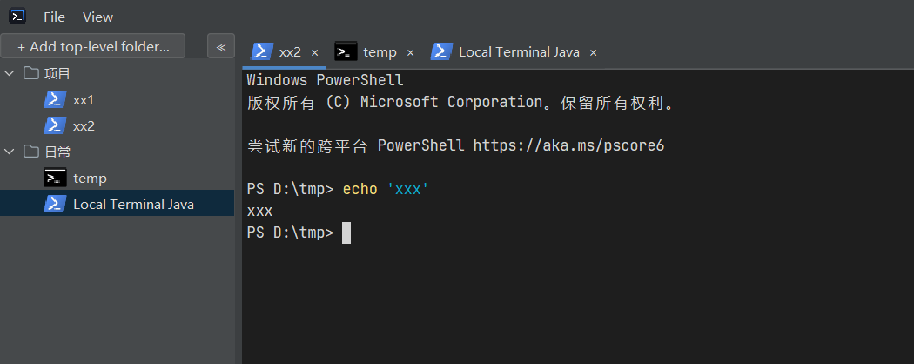

# local-terminal-java

A Windows desktop terminal manager built on JediTerm + pty4j + ConPTY.  



## Prerequisites
- JDK 17 (on PATH; JAVA_HOME will be auto-detected by the install script)
- Maven 3.9+
- JediTerm

## Setup

1. Build:
   ```
   mvn clean package
   ```
2. Run:
   ```
   target/dist/Local Terminal/Local Terminal.exe
   or
   java -jar target\local-term-java-0.1.0-SNAPSHOT.jar
   ```
## Manual integration test
1. Run app — tree panel appears empty.
2. Right-click root → Add Child → fill `name`, `shellPath` (e.g. `C:\Windows\System32\cmd.exe`), `startPath` (e.g. `C:\Users\<your-username>`). Click OK.
3. Double-click the new node → terminal tab opens.
4. Type `dir` — output renders.
5. Close tab — verify no orphaned process in Task Manager.
6. Click a folder's ▶ handle to collapse it; restart the app — folder is still collapsed.
7. Click the same handle to expand; restart — folder is still expanded.
8. Drag a Shell into a sibling folder — Shell becomes a child of that folder (auto-expanded).
9. Drag a Shell above another Shell in the same folder — reorders as siblings.
10. Drag a Shell into one of its own ancestors — no-op (cursor says "not allowed").
11. Drag a Shell onto a Shell — no-op.
12. Add a Shell with no iconPath and `shellPath = C:\Program Files\Git\bin\bash.exe` — bash icon appears.
13. Edit that Shell and set `iconPath` to a PNG, JPEG, ICO, or SVG file (one at a time) — custom icon replaces the default. A non-existent path falls back to the default with a warning in the log.

## Default and custom shell icons

When a shell node has no `iconPath` set, the tree shows a default icon
matched from the shell's `shellPath` (e.g. `bash` → bash icon, `cmd` →
cmd icon, `wsl` → bash icon). The 13 default icons (12 named shells plus
a generic `default.svg`) are committed as vector SVGs in
`src/main/resources/shell-icons/`. At lookup time, `ShellIconResolver`
rasterises the matching SVG directly at the L&F's folder-icon size
(typically 16×16 on Windows / Metal / Nimbus) using Apache Batik, so
the result is crisp at every L&F without an intermediate 32×32 raster
that would have to be downscaled.

You can override the default by editing a shell and setting `iconPath` to
any common image file: PNG, JPEG, BMP, GIF, ICO, or SVG. If the file is
missing or in an unsupported format, the resolver logs a warning and
falls back to the default icon. User-supplied SVGs are also rendered at
the target size; user-supplied raster formats are decoded at native
size and the renderer scales them on the fly.

The set of bundled defaults: bash, cmd, dash, fish, ksh, nushell,
powershell, pwsh, sh, tcsh, xonsh, zsh — plus a generic `default.svg`
for shells whose path doesn't match any of these.

## Re-syncing the default shell icons

The 12 default shell SVGs live in the sibling
`local_terminal/src/renderer/assets/shell-icons/` directory. To
re-sync them (e.g. after a sibling project change), run
`scripts\convert-shell-icons.bat`. The script copies the SVGs into
`src/main/resources/shell-icons/` — no SVG → PNG conversion step is
needed, since the resolver renders the SVGs at the target size on
demand. Re-runs are idempotent.

## Troubleshooting
- "Package not found" for `org.jetbrains.jediterm:*` → re-run `scripts\install-jediterm.bat`.
- "Pty4J native load failed" → ensure 64-bit JDK matches the pty4j native DLL bundled in the jar.

## See also
- `docs\superpowers\specs\2026-07-13-java-terminal-manager-design.md` — full design spec

## Manual integration test — auto-script

These verify the optional auto-script feature on shell nodes.

1. Add a shell node with `shellPath = C:\Windows\System32\cmd.exe` or `shellPath = cmd`,
   enable auto-script, and add exactly one step:
   - Wait pattern: `Microsoft Windows`
   - Command: `echo hello from auto-script`
   Click Add/Save.
2. Double-click the new node → a terminal tab opens. Within ~1 second of
   the `Microsoft Windows ...` banner being printed, the line
   `hello from auto-script` is sent. The tab stays open.
3. Edit the same shell and change the wait pattern to a string that will
   **never** appear (`never:`). Save. Double-click the shell again → after
   ~10 seconds the tab closes itself. The log file
   (`<user home>\.local-term-java\config.json` directory) shows an
   `ERROR ... AutoScript timed out` line.
4. Restart the application → the saved auto-script survives (same timeout,
   same steps). Double-click to re-run.
